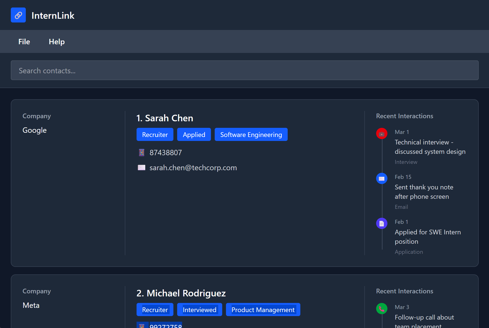

This project is based on the AddressBook-Level3 project created by the [SE-EDU initiative](https://se-education.org).
* This is **a project designed as a contact management app for students looking for internships**. 
  Example usages:
  * storing the contact details of people who they have met during career fairs
  * using tags to conveniently tag specific contacts based on their key information
* It is named `InternLink` as a wordplay between `Intern` and `Interlink`. We hope that this app can help to link student interns together in meaningful networks.
* For the detailed documentation of this project, see the **[InternLink Product Website](https://ay2526s2-cs2103t-t12-3.github.io/tp/)**.

