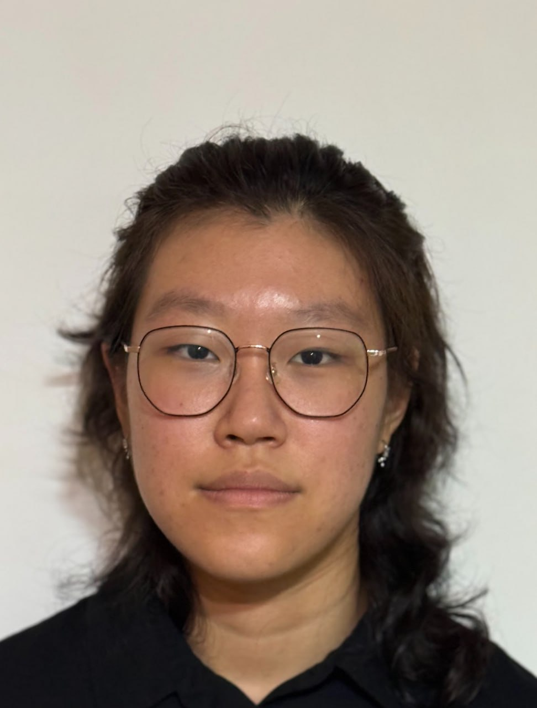

layout: page
title: About Us
---

We are a team based in the [School of Computing, National University of Singapore](https://www.comp.nus.edu.sg).

## Project team

### Tan Jun Shane

[[github](https://github.com/Raylong268)]

* Role: Team Lead
* Responsibilities: Model

### Devon Sebastian Koswara

[[github](http://github.com/spiritsk8)]

* Role: Programmer
* Responsibilities: UI, Code quality

### Darren Lee

[[github](http://github.com/darrenlhs)]

* Role: Developer
* Responsibilities: Testing, Deliverables and deadlines

### Sarina Ke

[[github](http://github.com/sarinake)]

* Role: Developer
* Responsibilities: Storage, Integration

### Yujia Wang

[[github](http://github.com/yujiawang-0)]

* Role: Developer
* Responsibilities: Documentation, Scheduling and tracking
